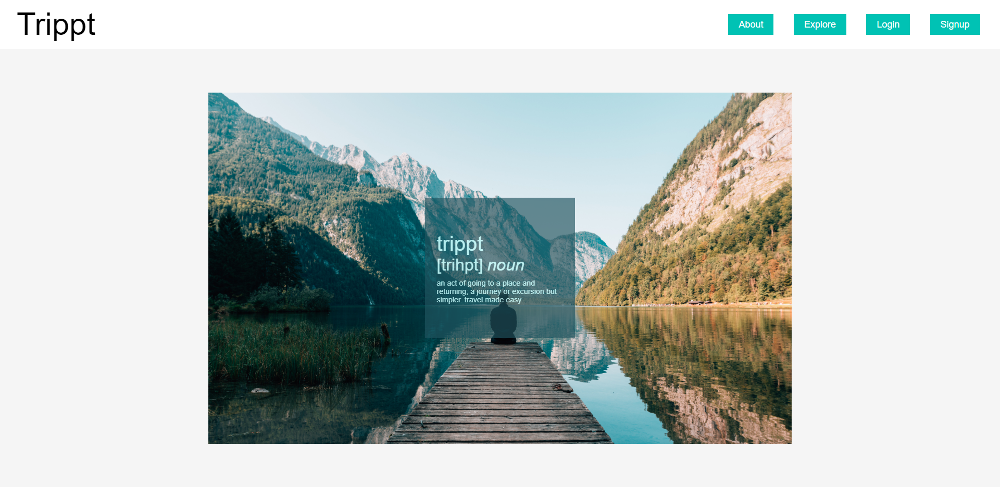
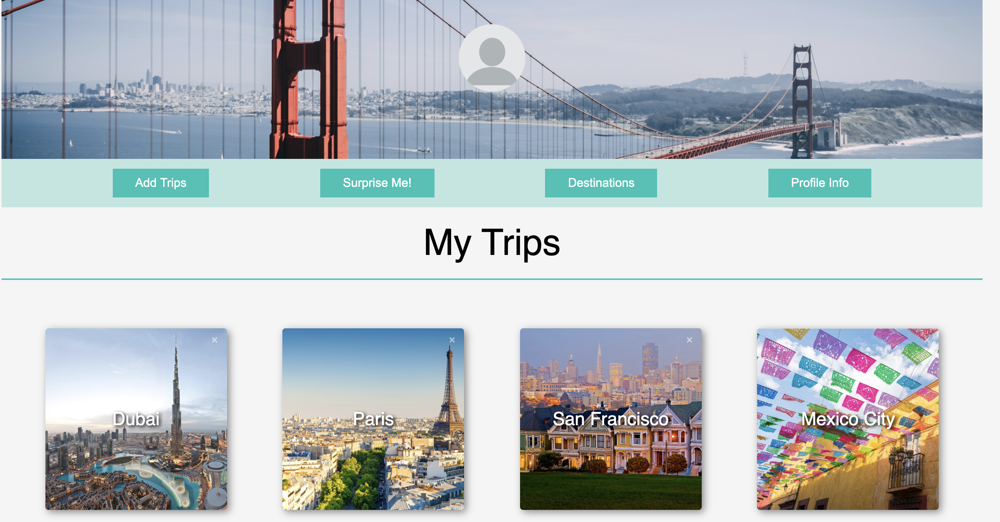

# Overview 

<strong>Trippt</strong> is a single-page web app that offers users a simple way to find things to do when they travel. Trippt offers the most trending recommendations in popular cities.

<a href="https://trippt.herokuapp.com/#/" target="_blank"><strong>Live Demo</strong></a>


# Technologies

### Backend

<ul>
	<a href="https://www.mongodb.com/" target="_blank"><li>MongoDB</li></a>
	<a href="https://expressjs.com/" target="_blank"><li>Express.js</li></a>
	<a href="https://www.heroku.com/" target="_blank"><li>Heroku</li></a>
</ul>

### Frontend

<ul>
	<a href="https://reactjs.org/" target="_blank"><li>React</li></a>
	<a href="https://redux.js.org/" target="_blank"><li>Redux</li></a>
	<a href="https://nodejs.org/en/" target="_blank"><li>Node.js</li></a>
</ul>

# Technical Challenges

<ul>
	<li>Incorporating Tripadvisor API</li>
	<li>Manipulating data from API axios calls</li>
	<li>Working with Express server and backend routes</li>
	<li>Fetching and connecting data from MongoDB to our Frontend</li>
</ul>


# Limited API 

One of the challenges we had is working with a limited API, therefore we wanted to always check to see if the information is already in local state or already added to your trips in the backend and if so we wanted to use that information instead.  This way, the site loads faster and we save making unecessary API calls.

```
componentDidMount(){
    let {locationId, locationName, attractions, restaurants, nightlife} = this.props

    if (!attractions[locationName]) {
      this.props.getAttractions(locationId, locationName)
    }

    if (!restaurants[locationName]) {
      this.props.getRestaurants(locationId, locationName)
    }
    
    if (!nightlife[locationName]) {
      this.props.getNightlife(locationId,locationName)
    }

    if(this.props.user.id){
      this.props.getUserTrips(this.props.user.id)
    }
  };
```

```
  componentDidMount(){
    let {tripAttractions, tripId, locationId, user, getUserTrips, getAttraction} = this.props

    if (user.id) {
      getUserTrips(user.id)
    }

    let foundAttraction = tripAttractions[tripId] ? 
      this.findAttraction(tripAttractions[tripId].attractions, locationId) : null

    if (!tripAttractions || !foundAttraction) {
      getAttraction(locationId)
    }

    if (foundAttraction) {
      this.setState({foundAttraction: true})
    }
    
  };
```

# Features
<ul>
	<li>Responsive single page app for finding new places to explore and activities to do</li>
	<li>New users are able explore the site without signing up or logging in </li>
	<li>Users are able to sign up for an account and log in securely for core features such as creating, updating and deleting trips</li>
	<li>Logged in users can create and update their profile</li>
</ul>	


## Experiences


Users can select from three different categories. They can choose from Attractions, Restaurants, and Nightlife. After a user selects one of these categories they are then shown the top recommended experiences. 


## Login


```
 // Handle field updates (called in the render method)
  update(field) {
    return e => this.setState({
      [field]: e.currentTarget.value
    });
  }

  // Handle form submission
  handleSubmit(e) {
    e.preventDefault();

    let user = {
      email: this.state.email,
      password: this.state.password
    };

    this.props.login(user)
      .then(() => this.props.history.push("/profile"))
  }

  // Render the session errors if there are any

  renderErrors() {
    return (
      <ul className='error-messages'>
        {Object.keys(this.props.errors).map((error, i) => (
          <li key={`error-${i}`}>
            {this.props.errors[error]}
          </li>
        ))}
      </ul>
    );
  }

```

## Trips


## User Profile


## Dynamic Experience

Users can experience our explore tab without logging in.  They can checkout the locations and the attractions that place has to offer, but they are not able to save the trips and attractions for future use.  Once a user signs up and logs in, they also have multiple portals to add or remove locations and attractions to their trips.  A logged in user also has the option of adding a location to their trips if the location isn't already added to their trips.


```
{myTrips.length === 0 && this.props.loggedIn ? (
            <li
              className="add-city"
              onClick={() =>
                this.props.createTrip({
                  location: this.props.locationName,
                  locationId: this.props.locationId,
                })
              }
            > Add {this.props.locationName} to my Trips!
            </li>
```


## Surprise Me!

Feeling adventurous? A logged in user can click the Surprise Me! button to have a location selected for them. Still can't decide what activities to do?  Click on the Surprise Me! button on the explore page to have attractions selected for that trip.


```
  tripptMe(tripId, ...args) {
    args.forEach(arr => {
      let rand = this.randNum(arr.length)
      this.props.updateTrip(tripId, arr[rand])
    })
  }

  disableButton() {
    let surpriseBtn = document.getElementById('surprise-btn')
    if (surpriseBtn) {
      surpriseBtn.disabled = true
      surpriseBtn.innerText = "Added activities to your trip"
      surpriseBtn.className = 'surprise-btn'
    }
  }
```


# Contributors

<ul>
	<a href="https://github.com/Rasheeq-Ahmed/" target="_blank"><li>Rasheeq Ahmed</li></a>
	<a href="https://github.com/echen831" target="_blank"><li>Eric Chen</li></a>
	<a href="https://github.com/hsachdeva01" target="_blank"><li>Hari Sachdeva</li></a>
</ul>
